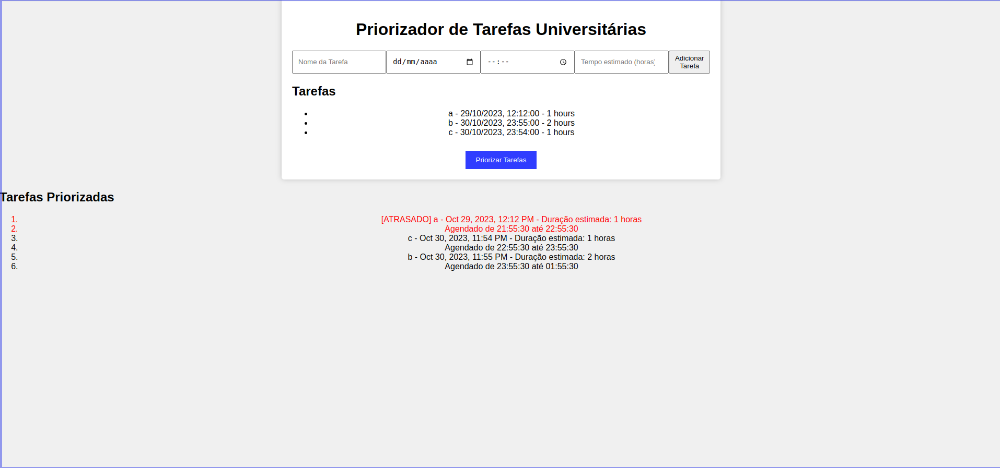
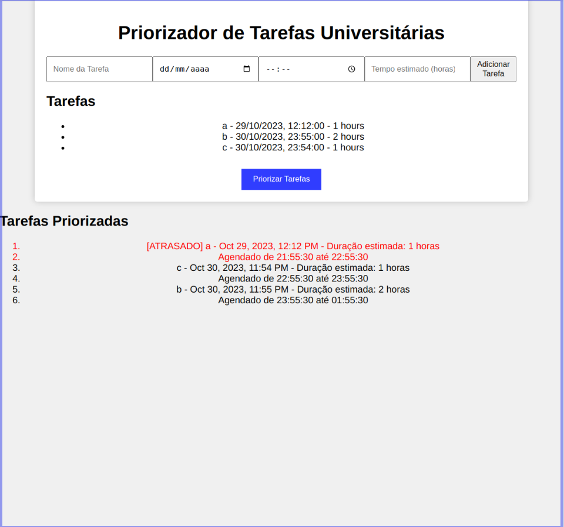
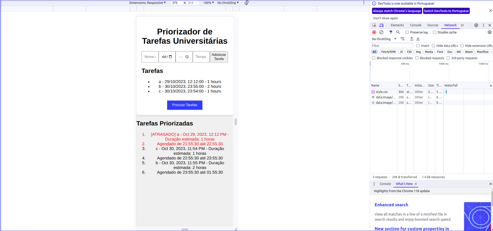

# Priorizador de Tarefas Universitárias

**Conteúdo da Disciplina**: Greed 

## Alunos

| Matrícula  | Aluno                                                              |
| ---------- | ------------------------------------------------------------------ |
| 20/2023743 | [Iago Sousa Matos Campelo](https://github.com/iagoscm)             |
| 21/1043683 | [Marcus Vinícius Paiva Martins](https://github.com/marcusmartinss) |

### Apresentação

[Apresentação em Vídeo](./assets/Apresentacao_Greed.mp4)

## Sobre

O Priorizador de Tarefas universitárias é uma aplicação web para verificar quais tarefas devem ser feitas antes do prazo de encerramento mais próximo.

## Screenshots

  

  

  

## Instalação

**Linguagem**: HTML, CSS, Javascript 

- Requisitos: Navegador web com suporte a HTML, CSS e Javascript.

## Uso

1. Abra o arquivo HTML no navegador

2. Dê um nome à tarefa

3. Coloque a data limite da tarefa

4. Defina o horário limite da tarefa

5. Escolha um tempo estimado (em horas) para a tarefa a ser realizada

6. Adicione a tarefa

7. Adicione outras tarefas

8. Pressione "Priorizar Tarefas"

9. As tarefes estarão priorizadas conforme a data de vencimento, as vencidas estarão em vermelho com o prefixo `[ATRASADO]`

